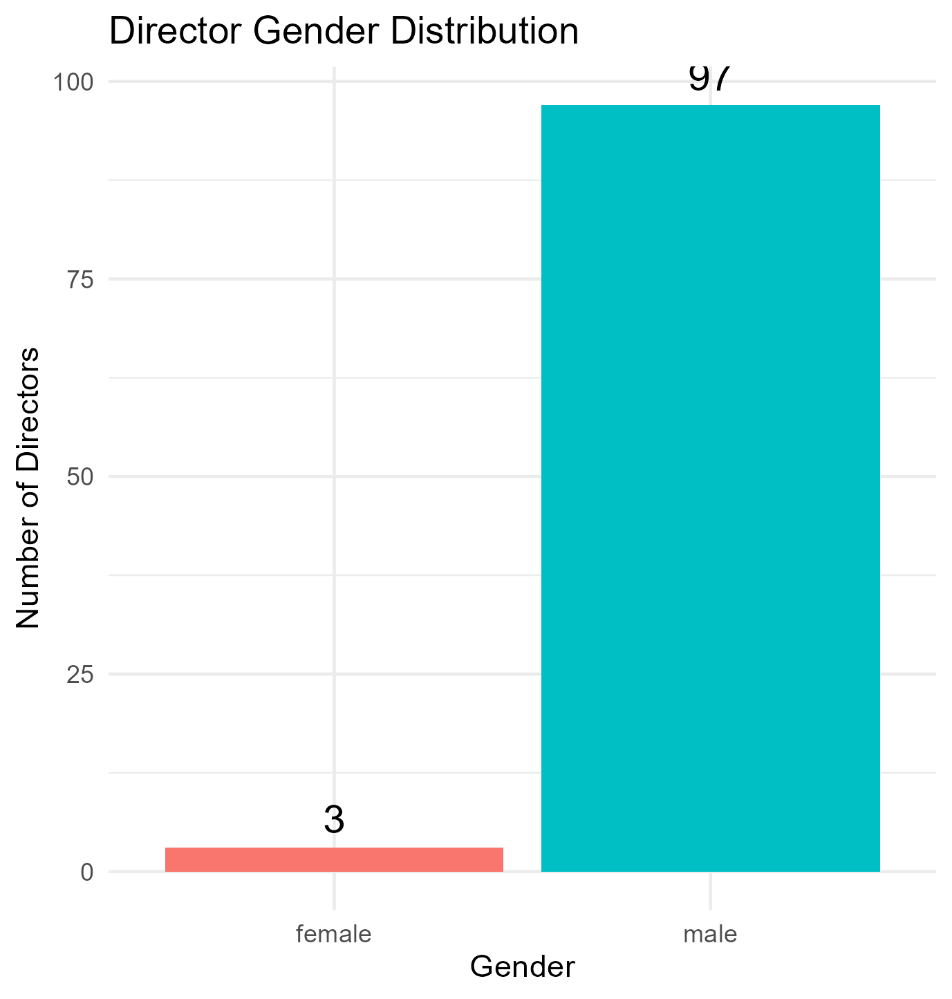
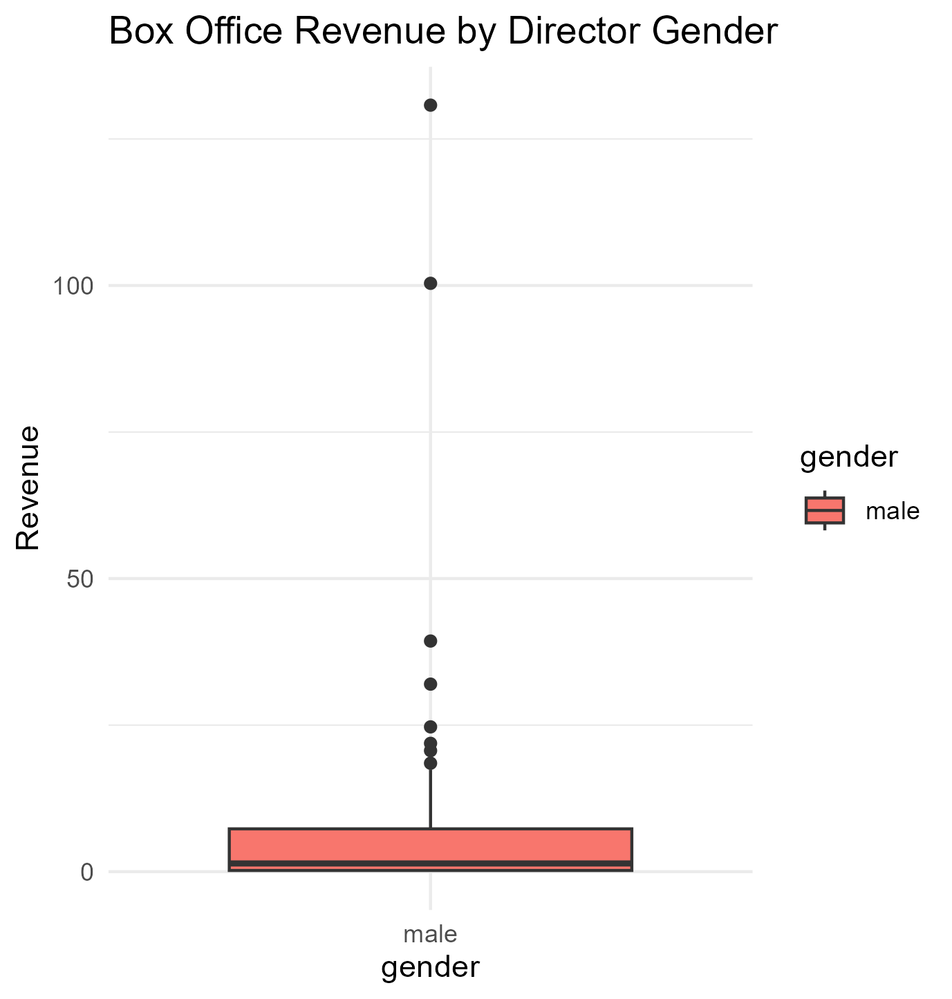
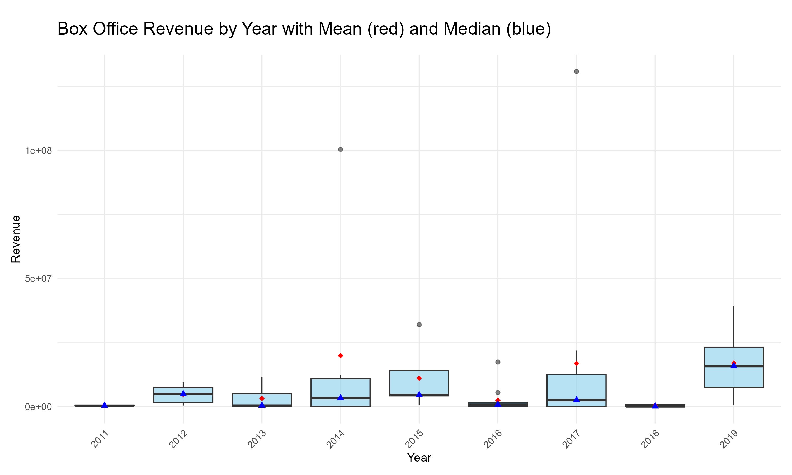

  
# Bollywood Cinema Sentiment Lab – Final Report
[GitHub Repository](https://github.com/azadecon/cinema-sentiment-lab)


## Objective

This project establishes a reproducible pipeline for analyzing cultural and political themes in contemporary Bollywood films (post-2010). Using a randomly sampled dataset of 100 movies, the study integrates subtitle files, plot descriptions, and poster images to explore themes such as Hindu–Muslim relations, gender dynamics, nationalism, and an additional theme: urban struggles. The pipeline incorporates LLM-based approaches for both data enrichment and thematic analysis.

---
  
## Data Collection & Pipeline Overview
  
The pipeline comprises six distinct stages, primarily implemented in R, with Python auxiliary calls for data acquisition where beneficial.

1.  **Sampling & Setup (`01_data_sampling_and_setup.R`)**:
  * Downloaded the Kaggle dataset and generated a random sample of 100 movies released after 2010.
* Cleaned and merged sampled movies to ensure dataset quality.

2.  **Asset Collection (`02_fetch_movie_assets.R`)**:
  * **Subtitles**: Acquired via SubDL API, including structured handling of ZIP files.
* **Descriptions**: Sourced from Wikipedia using an API-driven, section-specific scraping approach for plot extraction.
* **Posters**: Retrieved using the TMDb API, with IMDb ID to TMDb ID mapping.
* **Robustness**: Incorporated comprehensive error handling and `Sys.sleep` for respectful API/scraping practices.

3.  **Metadata Collection (`03_fetch_movie_metadata.R`, `03_analyse_movie_metadata.R`)**:
  * **Director Names & Box Office**: Scraped from Box Office Mojo using tailored R functions with mimicked browser headers.
* **Director Gender Inference**: Employed the Gemini LLM for name-based gender prediction, a key demographic indicator.
* **Analysis**: Generated initial descriptive plots for director gender distribution and box office trends.

4.  **Thematic Data Building (`04_build_movie_themes.R`)**:
  * Combined movie plots and systematically cleaned subtitle texts into a unified dataset for thematic processing.
* Robust subtitle parsing and cleaning (`clean_subtitles` function) to remove timestamps, line numbers, and watermarks.

5.  **Sentiment and Theme Analysis (`04_thematic_analysis.R`)**:
  * **Theme Presence**: Prepared the pipeline to Utilize Gemini LLM to identify the presence of "Hindu–Muslim relations", "Gender relations", and "Nationalism" within movie plots.
* **Sentiment Classification (Strategy)**: Due to LLM API credit limitations, a detailed strategy for chunk-wise subtitle analysis, anchoring to plot descriptions, and maximum sentiment aggregation is proposed and documented. This ensures scalability for future full-scale implementation.

6.  **Visualization (See below)**: Plots generated using `ggplot2` in R.

---
  
## Thematic Coding Strategy (Contd.)
  
The thematic coding strategy emphasizes a multi-stage LLM application:
**Theme Presence**: LLM-based detection of specified themes using movie plot summaries. This leverages the LLM's understanding of narrative context. Plot understanding can be further enriched by incorporating narrative summaries from sources like `Letterboxd`.
  
* **Sentiment Analysis Strategy**: As detailed in [`scripts/sentiment_analysis.md`](https://github.com/azadecon/cinema-sentiment-lab/blob/main/scripts/sentiment_analysis.md), my proposed method addresses context window limitations by chunking long texts (like subtitles), anchoring analysis to overarching plot themes, and aggregating sentiment for a robust measure. This systematic approach ensures accurate, context-aware sentiment classification for: *Exclusionary–Inclusive*, *Progressive–Conservative*, and *Positive–Negative*.

---

## Additional Theme: Urban Struggles

**Justification**: Urban life in contemporary Indian cinema often portrays unique socio-economic and emotional conflicts distinct from traditional rural narratives or broader nationalistic themes. Films like *Gully Boy*, *Wake Up Sid*, and *Lipstick Under My Burkha* exemplify these struggles, highlighting themes of anonymity, high-density living, and inequality. This dimension offers valuable insights into evolving societal challenges and complements existing thematic binaries, adding depth to the cultural analysis.

---

## Visualizations

### 1. Director Gender Distribution

> 
> This plot displays the inferred gender distribution of directors in the sampled movie dataset, utilizing LLM-based name-to-gender inference.

---

### 2. Box Office Collection by Director Gender

> 
> Illustrates the distribution of box office revenues, categorized by the inferred gender of the directors, highlighting potential disparities. Current analysis does not show female due to lack of data.

---

### 3. Box Office Collection Over Time (2010–Present)

> 
> Shows the trend of box office collections for sampled movies from 2010 onwards, with red indicating the mean and blue the median revenue per year.

---

## Directory Structure Snapshot

```bash
data/
- clean/          # Final structured datasets
- raw/            # Raw scraped data (subtitles, plots, metadata, posters)
- build/          # Combined thematic and sentiment processing files
scripts/            # All R scripts (helpers, data acquisition, analysis, plotting)
output/             # Final plots and figures
README.md           # Project description
supplementary_ideas.md  # Suggestions for data enrichment

```


